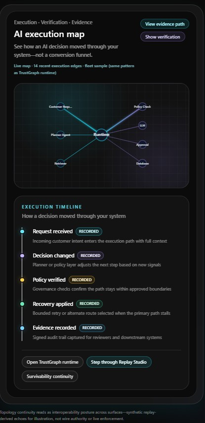
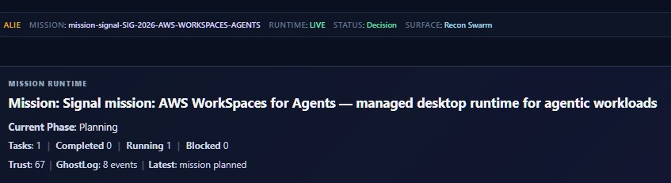
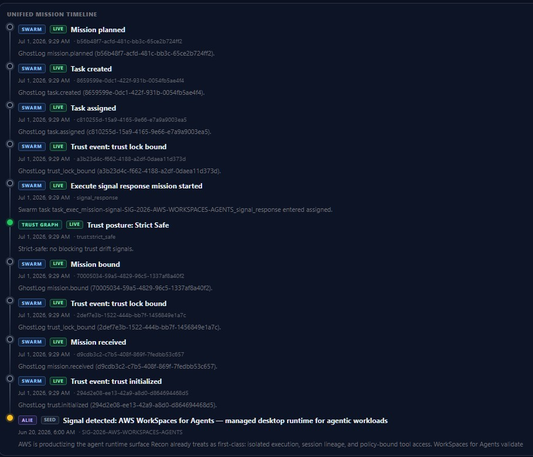
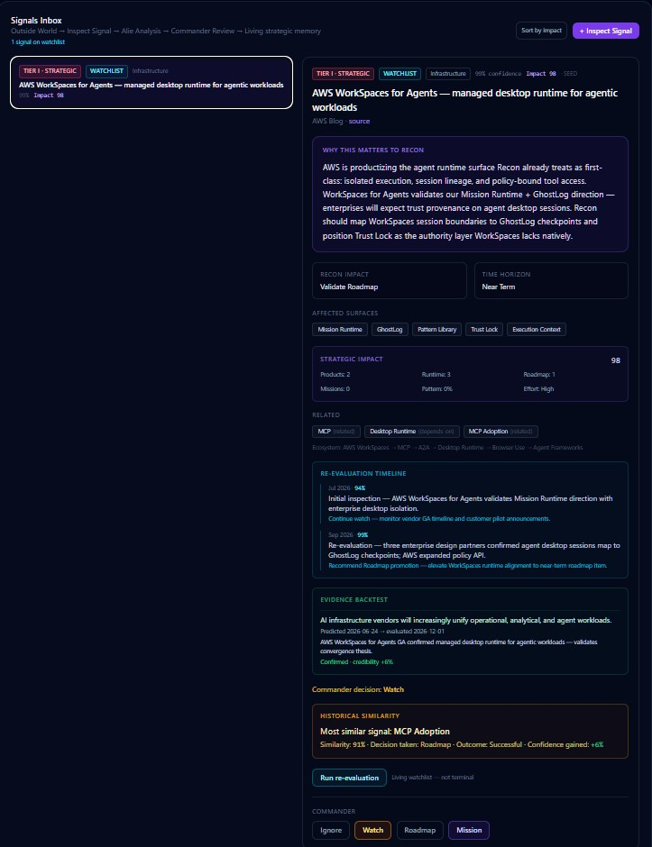
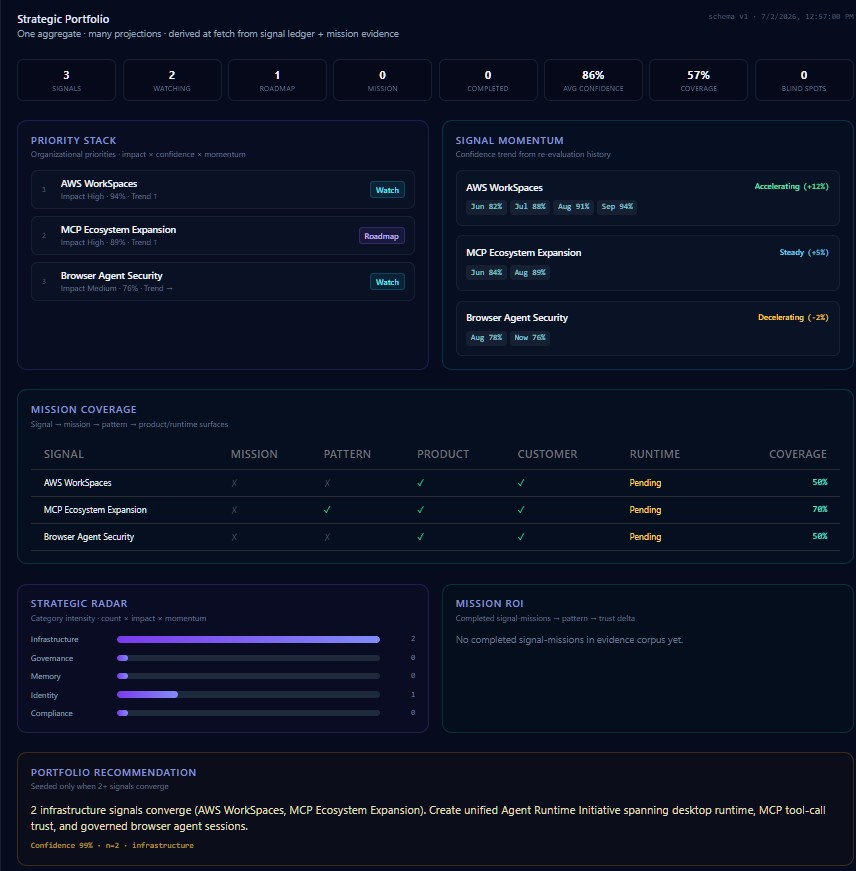
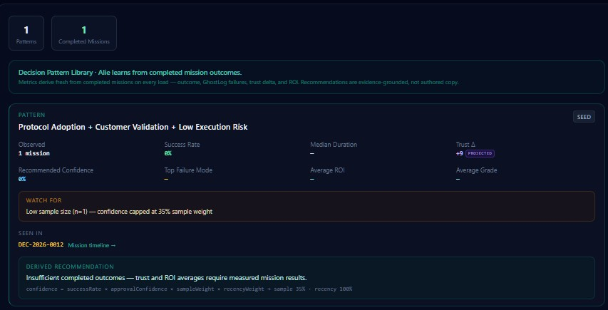

# Trust Accounting Showcase

## Executive Summary

Recon Runtime is the trust runtime for AI systems.

Trust Accounting is the flagship implementation.

It helps organizations detect, explain, prove, recover, and learn from AI decisions through auditable evidence.

This repository is the public **aggregate** for that story. Architecture notes, SDK examples, API snippets, and demo links are **projections**—sanitized artifacts you can clone, run, and share without internal monorepo access.

---

## Why this repository exists

If you landed here expecting the full Recon production codebase, this is intentional.

**Trust Accounting Showcase** is the public home for Recon Runtime's Trust Accounting platform: architecture concepts, Trust Interval vocabulary, SDK patterns, API examples, and vertical adapter demos. It mirrors how the runtime itself works—one aggregate, many projections—without shipping internal strategy, pricing, or proprietary monorepo contents.

Use this repo to **discover** how Recon thinks about trust, **run** sanitized examples, and **integrate** with public SDK and API surfaces. Production wiring lives in your deployment and in companion public repos (LangChain adapters, npm packages when published).

---

## Trust Interval

Every trustworthy AI system must answer five questions. Recon maps them to runtime objects through the **Trust Interval**—a continuous lifecycle from detection through learning:

```
Detect
↓
Explain
↓
Prove
↓
Recover
↓
Learn
```

| Phase | Question | Public language | Runtime object |
|-------|----------|-----------------|----------------|
| **Detect** | What happened? | Evidence | GhostLog |
| **Explain** | Why did it happen? | Trust Context | Trust Graph |
| **Prove** | Can I prove it? | Verifiable Audit Artifacts | AI Receipts / Trust Statements |
| **Recover** | What should happen next? | Runtime Decisions | Mission Runtime |
| **Learn** | Will this happen again? | Organizational Learning | Pattern Library |

Trust Accounting is where those answers become **measurable trust posture**—decomposed trust indices, factor contributions, movement deltas, and diagnostics operators can read without opening model weights.

Learn more: [The Trust Interval](https://reconai.net/homepage/trust-interval)

---

## Runtime Architecture

Recon's runtime spine connects execution, evidence, context, learning, and operator intelligence. Each block below is a runtime object with public language operators and reviewers can share.

**Mission Runtime** — Policy-governed execution, recovery, and bounded authority at mission scope. Runtime Decisions stay receipt-backed: retry, reprompt, and containment paths are governed, not improvised.

**GhostLog (Evidence)** — Signed step lineage—the spine every product projects from. Every action is visible before failures compound, giving operators and auditors a durable evidence trail.

**Trust Graph (Trust Context)** — Relationships, topology, and cross-mission lineage—not opaque scores alone. Trust posture becomes portable across handoffs and review surfaces.

**Pattern Library (Organizational Learning)** — Mission outcomes distilled into retained patterns so teams learn without amnesia. Completed missions feed a compounding evidence corpus the runtime can query on the next decision.

**Inspect Signal** — Outside-world signals enter the runtime through a structured inspect workflow: normalize inputs, run evidence-grounded analysis, and route commander review before strategic memory updates.

**Strategic Portfolio** — One aggregate view of strategic signals, impact, and historical similarity—many projections for operators tracking what matters across missions and time horizons.

---

## Maturity Map

| Capability              | Status         |
| ----------------------- | -------------- |
| Mission Runtime         | ✅ Stable       |
| Trust Accounting        | ✅ Stable       |
| GhostLog                | ✅ Stable       |
| TrustGraph              | ✅ Stable       |
| Pattern Library         | ✅ Operational  |
| Inspect Signal          | ✅ Operational  |
| Strategic Portfolio     | ✅ Operational  |
| Organizational Learning | 🟢 Compounding |

The evidence platform connects live missions to the trust records Trust Accounting produces—**Unified Timeline**, **Inspect Signal**, **Strategic Portfolio**, and evidence-derived learning share the same GhostLog spine.

---

## Screenshots

Capture these from the live deployment at [reconai.net](https://reconai.net) when publishing visual assets. Placeholders keep the repo clone-friendly without binary files.

| Surface | Placeholder |
|---------|-------------|
| Homepage hero |  |
| Mission Runtime |  |
| Unified Timeline |  |
| Inspect Signal |  |
| Strategic Portfolio |  |
| Pattern Library |  |

Add PNG or WebP files under `docs/screenshots/` with the filenames above when ready.

---

## Architecture

This README is the aggregate. Deeper projections live elsewhere—follow links instead of duplicating diagrams here.

| Resource | Link |
|----------|------|
| Trust Accounting architecture | [`docs/architecture.md`](docs/architecture.md) |
| The Trust Interval | [reconai.net/homepage/trust-interval](https://reconai.net/homepage/trust-interval) |
| Public website | [reconai.net](https://reconai.net) |
| LangChain adapter | [Trustbyrecon/reconai-langchain](https://github.com/Trustbyrecon/reconai-langchain) |
| LangChain quickstart | [Trustbyrecon/reconai-langchain-quickstart](https://github.com/Trustbyrecon/reconai-langchain-quickstart) |

### Showcase artifacts

| Artifact | Link |
|----------|------|
| TypeScript examples | [`examples/`](examples/) |
| API snippets + OpenAPI excerpt | [`api/`](api/) — [`openapi-reference.yaml`](api/openapi-reference.yaml), [`receipt.sh`](api/receipt.sh), [`diagnostics.sh`](api/diagnostics.sh), [`report.sh`](api/report.sh) |
| Trust Accounting Playground | [reconai.net/trust-accounting/playground](https://reconai.net/trust-accounting/playground) *(public route when deployed)* |

---

## Design Principles

Recon is built around four architectural principles:

* One aggregate, many projections.
* Evidence before inference.
* Fix aggregates, never projections.
* Organizational learning compounds through completed missions.

---

## Roadmap

- **Runtime stability** — Harden Mission Runtime, GhostLog, TrustGraph, and Trust Accounting as the frozen evidence spine.
- **Organizational learning** — Expand Pattern Library retention and evidence-derived learning loops across missions.
- **Enterprise integrations** — Deeper adapter packs, export surfaces, and deployment-ready SDK mirrors on public npm.
- **Pattern intelligence** — Richer Inspect Signal and Strategic Portfolio projections grounded in completed mission evidence.

---

## License

MIT — see [LICENSE](LICENSE). Copyright Recon.AI.
