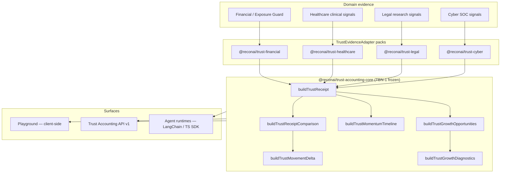

# Trust Accounting — Portfolio Showcase

**Evidence in. Auditable trust out.**

Trust Accounting is a domain-agnostic platform for turning operational signals into **explainable trust receipts**, **movement deltas**, **momentum timelines**, **growth opportunities**, and **root-cause diagnostics**. It was designed for regulated AI deployments where “the model scored 0.82” is not enough—you need factor decomposition, audit trails, and operator-readable narratives.

This repository is a **recruiter-friendly portfolio slice**: architecture, SDK patterns, API examples, and vertical adapters. It contains no internal strategy docs, pricing, or proprietary monorepo contents.

---

## What I Built

| Layer | Responsibility |
|-------|----------------|
| **Core SDK** (`@reconai/trust-accounting-core`) | Frozen TBN-1 builders: receipt, comparison, movement, timeline, opportunities, diagnostics |
| **Domain adapters** | Financial, Healthcare, Legal, Cyber — each implements `TrustEvidenceAdapter` |
| **HTTP API** | Observe-only REST surface (`/receipt`, `/diagnostics`, `/report`) |
| **Playground** | Browser-native pipeline — paste evidence, export JSON, no backend required |
| **Agent integration** | Python LangChain adapter + progressive quickstart (public repos) |

**Design principle:** adapters translate domain evidence → six universal trust factors. Core never imports a vertical. Formulas stay frozen; new domains ship as adapter packs.

---

## Architecture



See [`docs/architecture.md`](docs/architecture.md) for a deeper (still high-level) walkthrough.

---

## Trust Accounting Overview

Every trust receipt answers four operator questions:

1. **What is the trust index?** — Single posture score (0–100) with health label.
2. **Why this score?** — Six factor contributions: coverage, accuracy, calibration, drift, survivability, trust lock.
3. **What changed?** — Movement delta vs. a prior evidence snapshot.
4. **What should we fix?** — Ranked growth opportunities with root-cause diagnostics.

Outputs are **advisory only** (`carriesExecutionAuthority: false`). The platform observes and explains; execution authority stays in your governance layer.

### Sample receipt (truncated)

```json
{
  "trustIndex": 88,
  "posture": "clinical_assistant",
  "trustIndexScope": "posture",
  "factors": [
    { "id": "coverage", "label": "Coverage", "rawValue": "88%", "contribution": 22 },
    { "id": "accuracy", "label": "Accuracy", "rawValue": "82%", "contribution": 20 },
    { "id": "calibration", "label": "Calibration", "rawValue": "-1.5", "contribution": 18 },
    { "id": "drift", "label": "Drift", "rawValue": "Stable", "contribution": 14 },
    { "id": "survivability", "label": "Survivability", "rawValue": "79/100", "contribution": 14 },
    { "id": "trust_lock", "label": "Trust Lock", "rawValue": "91/100", "contribution": 0 }
  ],
  "aliethiaSummary": "Clinical assistant posture is strong; calibration drift is the primary growth lever.",
  "carriesExecutionAuthority": false
}
```

---

## Playground

The Trust Accounting Playground runs the full pipeline **in the browser** — no API keys, no persistence.

| Feature | Description |
|---------|-------------|
| Domain tabs | Financial · Healthcare · Legal · Cyber |
| Evidence input | Paste JSON or load scenario presets |
| Outputs | Receipt, comparison matrix, movement, timeline, opportunities, diagnostics |
| Export | Downloadable JSON with `_meta` provenance block |

**Live demo:** [recon.ai/trust-accounting/playground](https://recon.ai/trust-accounting/playground) *(public route when deployed)*

> **Screenshots:** Add `docs/screenshots/playground-receipt.png`, `playground-diagnostics.png`, etc. when capturing from the live playground. Placeholders keep this repo clone-friendly without binary assets.

---

## SDK Examples

TypeScript examples live under [`examples/`](examples/). They mirror production adapter patterns; package names reflect the intended npm surface.

| Example | Domain | File |
|---------|--------|------|
| Core pipeline | All | [`examples/sdk-core.ts`](examples/sdk-core.ts) |
| Financial | Exposure / portfolio postures | [`examples/financial.ts`](examples/financial.ts) |
| Healthcare | Clinical AI scopes | [`examples/healthcare.ts`](examples/healthcare.ts) |
| Legal | Legal research assistant | [`examples/legal.ts`](examples/legal.ts) |
| Cyber | SOC / detection AI | [`examples/cyber.ts`](examples/cyber.ts) |
| Full diagnostics | Movement + opportunities | [`examples/diagnostics-pipeline.ts`](examples/diagnostics-pipeline.ts) |

### Quick start (TypeScript)

```typescript
import { buildTrustReceipt, buildTrustGrowthDiagnostics } from "@reconai/trust-accounting-core";
import { healthcareAdapter } from "@reconai/trust-healthcare";

const evidence = {
  policyAdherence: 88,
  escalationAccuracy: 82,
  calibrationDelta: -1.5,
  safetyIncidents: 5,
  survivabilityScore: 79,
  reviewCompliance: 91,
};

const receipt = buildTrustReceipt(
  healthcareAdapter.toReceiptParams(evidence, "clinical_assistant")
);

console.log(receipt?.trustIndex, receipt?.aliethiaSummary);
```

### Agent runtime integration (Python / LangChain)

For wrapping LangChain agents with trust guards, GhostLog timelines, and recovery patterns:

| Repo | Purpose |
|------|---------|
| [Trustbyrecon/reconai-langchain](https://github.com/Trustbyrecon/reconai-langchain) | Python adapter library |
| [Trustbyrecon/reconai-langchain-quickstart](https://github.com/Trustbyrecon/reconai-langchain-quickstart) | Progressive examples `01` → `04` |

The broader TypeScript agent SDK (`@reconai/sdk` on npm) complements Trust Accounting for step-level wrapping and mission telemetry.

---

## API Examples

Trust Accounting API v1 is **observe-only**: POST evidence, receive structured reports. No persistence, no side effects.

| Endpoint | Returns |
|----------|---------|
| `POST /api/trust-accounting/receipt` | Single-posture Trust Receipt |
| `POST /api/trust-accounting/diagnostics` | Growth opportunities + root-cause diagnostics |
| `POST /api/trust-accounting/report` | Full pipeline (mirrors playground export) |

OpenAPI spec shape: [`api/openapi-reference.yaml`](api/openapi-reference.yaml) *(sanitized excerpt)*

Runnable snippets:

- [`api/receipt.sh`](api/receipt.sh) — Healthcare receipt
- [`api/diagnostics.sh`](api/diagnostics.sh) — Diagnostics with movement context
- [`api/report.sh`](api/report.sh) — Full report export
- [`api/fetch-examples.md`](api/fetch-examples.md) — `fetch` equivalents for Node/browser

Replace `BASE_URL` with your deployment origin. Examples use synthetic evidence only.

---

## Domain Adapters

Each vertical maps **six operational signals** onto the universal six trust factors. Adapters own translation; core owns math.

| Domain | Package | Scopes | Reference |
|--------|---------|--------|-----------|
| Financial | `@reconai/trust-financial` | aggressive, balanced, defensive, cash_heavy | Exposure Guard baseline |
| Healthcare | `@reconai/trust-healthcare` | clinical_assistant, triage_assistant, care_navigator, documentation_agent | Clinical compliance |
| Legal | `@reconai/trust-legal` | legal_assistant | Citation + hallucination monitoring |
| Cyber | `@reconai/trust-cyber` | cyber_defender | SOC detection + review compliance |

### Signal → factor pattern (Healthcare)

| Clinical signal | Trust factor |
|-----------------|--------------|
| `policyAdherence` | Coverage |
| `escalationAccuracy` | Accuracy |
| `calibrationDelta` | Calibration |
| `safetyIncidents` (inverted) | Drift |
| `survivabilityScore` | Survivability |
| `reviewCompliance` | Trust Lock |

Legal and Cyber follow the same adapter contract with domain-specific semantics — see [`examples/`](examples/).

---

## Audit Trails & Diagnostics

Trust receipts integrate with **GhostLog-style audit timelines** via adapter names (`healthcare_ops`, `legal_ops`, `exposure_guard`, etc.). Each receipt is reproducible: same evidence + frozen TBN-1 anchor → same factor decomposition.

**Diagnostics pipeline:**

```
TrustReceipt
  → buildTrustGrowthOpportunities   (ranked levers)
  → buildTrustGrowthDiagnostics     (root causes per lever)
  → buildTrustMovementDelta         (when previousEvidence supplied)
```

This gives compliance and platform teams **explainability without opening the model weights**.

---

## Repository Layout

```
trust-accounting-showcase/
├── README.md                 ← you are here
├── LICENSE                   ← MIT
├── docs/
│   └── architecture.md       ← high-level system design
├── examples/                 ← sanitized TypeScript samples
├── api/                      ← curl / fetch snippets + OpenAPI excerpt
└── .gitignore
```

---

## Related Public Work

| Surface | Link |
|---------|------|
| LangChain adapter | https://github.com/Trustbyrecon/reconai-langchain |
| LangChain quickstart | https://github.com/Trustbyrecon/reconai-langchain-quickstart |
| Company site | https://recon.ai |
| Playground (when live) | https://recon.ai/trust-accounting/playground |

---

## Status & Publishing

This showcase documents work completed in the Trust Accounting SDK track (RFC-001, TBN-1 frozen at anchor `c2395bf6`). Core and adapter packages are implemented and tested in a private monorepo; **npm publication of `@reconai/trust-accounting-core` and vertical packs is planned** as a separate public mirror release (same pattern as the LangChain growth repos).

---

## License

MIT — see [LICENSE](LICENSE). Copyright Recon.AI.
